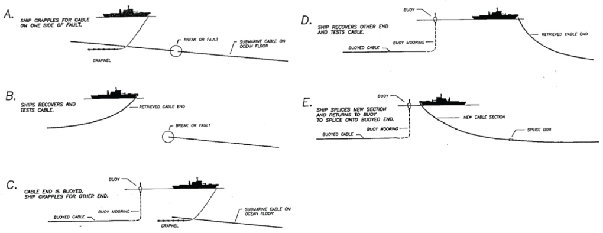

```{r setup, include=FALSE}
# set working directory
if (basename(getwd()) == 'nrel-cables') setwd('docs')
knitr::opts_chunk$set(warning=F, message=F, eval=T, echo=F, cache=T) # DEBUG

# load packages and variables
source('./packages_vars.R')
```

```{r includes}
fig_type = 'png' # 'png','pdf','html'
fig_dpi = 300
redo = F

if (interactive() || "rmarkdown.pandoc.to" %in% names(opts_knit$get()) && opts_knit$get("rmarkdown.pandoc.to") == 'html'){
  out_html = T
  #opts_chunk$set(echo=T)
  opts_chunk$set(echo=F)
} else {
  out_html = F
  opts_chunk$set(echo=F)
}

fmt_tbl = function(csv, params, energy_hdr, caption){

  # csv = wave_depth_cbls_csv; params = plot_energy_params$wave; energy_hdr = 'Wave Energy (kW/m)'; caption = 'Table 5: Area overlap with cables for wave energy (kW/m) by territory.'
  # csv = tide_depth_cbls_csv; params = plot_energy_params$tide
  # energy_hdr = 'Tidal power (W/m<sup>2</sup>)'
  # caption    = 'Table 4: Area of tidal power classes (W/m2) per US territory with percent overlap of safety separation scheme from existing submarine cables for new facilities (2 * depth) and new cables (3 * depth). Width of colored bars indicate value relative to rest of column. Assessed area is limited to a maximum depth (< 100 m) and minimum energy classes (> 500 W/m2) for viable tidal energy development.'
  
  d = get_tbl_energy_cbls(csv, params)
  
  hdr = htmltools::withTags(table(
    class = 'display',
    thead(
      tr(
        th(rowspan=2, 'Territory'),
        th(rowspan=2, HTML(energy_hdr)),
        th(rowspan=2, HTML('<i>Area (km<sup>2</sup>)</i>')),
        th(colspan=2, 'Overlap with Cable Separation'),
      tr(
        th(HTML('Min. - Max. km<sup>2</sup> (Min. - <i>Max. %</i>)')))))))

  d %>%
    mutate(
      territory  = ifelse(duplicated(territory), '', territory),
      o_2z_km2 = comma(round(cable2_km2)),
      o_3z_km2 = comma(round(cable3_km2)),
      o_2z_pct = sprintf('%0.1f', cable2_pct*100),
      o_3z_pct = sprintf('%0.1f', cable3_pct*100),
      overlap = sprintf(
        # get sprintf for padding with spaces
        sprintf(
          '%%%ds - %%%ds (%%%ds - %%%ds%%%%)',
          max(nchar(o_2z_km2)),
          max(nchar(o_3z_km2)),
          max(nchar(o_2z_pct)),
          max(nchar(o_3z_pct))),
        o_2z_km2, 
        o_3z_km2,
        o_2z_pct, 
        o_3z_pct),
      overlap     = str_replace_all(overlap, ' ', '&nbsp;'),
      overlap_svg = sprintf(
        '<svg xmlns="http://www.w3.org/2000/svg" version="1.1" width="100%%" height="16" preserveAspectRatio="xMaxYMin meet">
<g>
  <rect width="%0.1f%%" height="16" fill="Pink"></rect>
  <text text-anchor="end" x="100%%" y="14" font-family="Courier New" font-size="14px" color="black">%s</text>
</g>
</svg>', cable3_pct*100, overlap),
area_svg = sprintf(
  '<svg xmlns="http://www.w3.org/2000/svg" version="1.1" width="100%%" height="14px" preserveAspectRatio="xMaxYMin meet">
<g>
  <rect width="%0.1f%%" height="14" fill="DarkGray"></rect>
  <text text-anchor="end" x="100%%" y="11" font-family="Courier New" font-size="14px" color="black">%s</text>
</g>
</svg>', area_km2 / max(area_km2) * 100, comma(round(area_km2)))) %>% # ,
    select(territory, energy, area_svg, overlap_svg) %>%
    datatable(
      escape = F,
      rownames=F,
      container=hdr,
      caption=caption,    
      options = list(
        dom='t',
        pageLength = nrow(d), 
        ordering=F,
        autoWidth = TRUE,
        columnDefs = list(
          list(width = '80px', targets = c(2)),
          list(width = '240px', targets = c(3)),
          list(className='dt-right', targets=1:3))))
}

get_tbl_energy_cbls = function(csv, params){
  
  #csv    = wave_depth_cbls_csv
  #params = plot_energy_params$wave
  
  d = read_csv(csv) %>% # .$territory %>% # TODO: caption on Atlantic Islands dropping
    
    # read_csv(csv) %>% filter(territory %in% ter_atl_islands)
    filter(
      !is.na(territory),
      territory != 'ALL',
      depth_factor %in% params$depth_ranges,
      energy_factor != params$energy_labels[1]) %>%
    # summarize across depths
    group_by(territory, energy_factor) %>%
    summarize(
      area_km2 = sum(area_km2),
      cable2_km2 = sum(cable2_km2),
      cable3_km2 = sum(cable3_km2)) %>% 
    mutate(
      cable2_pct = cable2_km2 / area_km2,
      cable3_pct = cable3_km2 / area_km2,
      energy     = factor(energy_factor, params$energy_labels, ordered=T),
      pct_lbl    = sprintf('%0.1f - %0.1f%%', cable2_pct*100, cable3_pct*100)) %>%
    ungroup() %>%
    arrange(territory, energy) %>%
    select(territory, energy, area_km2, cable2_km2, cable3_km2, cable2_pct, cable3_pct, pct_lbl)

  d
}

plot_cbls = function(
  csv           = tide_depth_cbls_csv,
  params        = plot_energy_params$tidal,
  legend_position      = c(1,1),
  legend_justification = c(1,1)){ 

  # csv    = wave_depth_cbls_csv
  # params = plot_energy_params$wave
  # legend_position      = c(1,0.3)
  # legend_justification = c(1,1)
  
  d = get_tbl_energy_cbls(csv, params)

  d_lbl = d %>%
    mutate(
      type = NA)
  
  d_p = d %>%
    mutate(
      min_2d = cable2_km2,
      rec_3d = cable3_km2 - cable2_km2,
      rem    = area_km2 - cable3_km2) %>%
    select(
      territory, energy, min_2d, rec_3d, rem) %>%
    gather(type, km2, -energy, -territory) %>%
    mutate(
      type = factor(
        type,
        names(cable_ord),
        cable_ord, ordered=T)) %>%
    arrange(territory, energy, type)
  
  p = ggplot(
      data=d_p,
      aes(x = energy, y = km2/1000, fill=type)) +
    geom_col() +
    geom_text(
      data=d_lbl,
      aes(x = energy, y = area_km2/1000, label=pct_lbl), vjust=-0.5, size=2.5) +
    labs(
      x = parse(text=params$xlab), 
      y = expression(paste('Area (1,000 ', km^2,')')), fill='Overlap') +
    theme(
      legend.justification = legend_justification, 
      legend.position      = legend_position,
      axis.text.x = element_text(angle = 45, hjust = 1)) + 
    expand_limits(y = expand_range(c(0, max(d$area_km2/1000)), mul=0.1)[2]) + 
    facet_wrap(~territory) 
  print(p)
}

fig_exists = function(fig){ 
  fig_ext = sprintf('%s.%s', fig, fig_type)
  file.exists(fig_ext)}

map_cable = function(
  ter,
  fig,
  redo){
  # ter = 'Hawaii'; fig = sprintf('figs/mapCable_%s', str_replace_all(ter,' ','-')); energy_sf = wind_sf; legend_title = sprintf('Submarine cables within %s EEZ.', ter); redo = T
  
  fig_ext = sprintf('%s.%s', fig, fig_type)
  if (!file.exists(fig_ext) | redo){
    
    eez = usa_eez %>%
      filter(territory==ter)
    cables = lns_d1x %>%
      filter(territory==ter)
    cables2 = dx2 %>%
      filter(territory==ter)
    cables3 = dx3 %>%
      filter(territory==ter)
    
    bb = st_bbox(eez)
    bb_ply = st_sf(
      tibble(
        territory = ter,
        geom = st_sfc(st_polygon(list(rbind(
          c(bb['xmin'], bb['ymin']),
          c(bb['xmax'], bb['ymin']),
          c(bb['xmax'], bb['ymax']),
          c(bb['xmin'], bb['ymax']),
          c(bb['xmin'], bb['ymin'])))), crs = 4326)))
    earth = land %>%
      filter(
        st_intersects(land, bb_ply, sparse=F)[,1]) # plot(earth)

    p = ggplot(data=eez) +
      geom_sf(data=earth, fill='gray40', size=0.2, color=NA) +
      geom_sf(data=eez, fill=NA, color='gray40') +
      geom_sf(data=cables3, fill='red', color=NA, alpha=0.15) +
      geom_sf(data=cables2, fill='red', color=NA, alpha=0.15) +
      geom_sf(data=cables, color='red', size=0.1, alpha=0.9) +
      coord_sf(
        xlim=bb[c('xmin','xmax')], 
        ylim=bb[c('ymin','ymax')])
      
    if (fig_type=='pdf'){
      pdf(fig_ext, width=6.5, height=5)
    }  else {
      png(fig_ext, res=fig_dpi, width=6.5, height=5, units='in')
    }
    print(p)
    dev.off()
  }
  #system(sprintf('open %s', fig))
  #knitr::include_graphics(fig, dpi=fig_dpi)
}

map_energy_sf = function(
  energy_sf,
  ter,
  legend_title){
  # ter = 'Hawaii'; energy_sf = wind_sf; legend_title = 'Wind<br>power (m/s)'; redo = T
  # ter =   'West'; energy_sf = wave_sf; legend_title = 'Wave\nenergy\n(kW/m)'; redo = T
  
  d = energy_sf %>% 
    filter(territory==ter)
  cables = lns_d1x %>%
    filter(territory==ter)
  cables2 = cbls2 %>%
    filter(territory==ter)
  cables3 = cbls3  %>%
    filter(territory==ter)

  bb = st_bbox(d)

  pal_energy = colorFactor('BuGn',      d$energy)
  pal_depth  = colorFactor('OrRd', cables3$depth, reverse=T)
  
  m = leaflet(d, 
              options=c(leafletOptions(), attributionControl=F, zoomControl=F)) %>% 
    addProviderTiles('Stamen.TonerLite', group = 'B&W') %>%
    #addProviderTiles('Esri.OceanBasemap', group = 'Ocean') %>%
      #, options = c(providerTileOptions(), list(attribution=''))) %>% # 
    addPolygons(
      group=legend_title,
      #fillColor = ~pal_energy(energy), fillOpacity = 0.5, color=NA) %>% 
      fillColor = ~pal_energy(energy), fillOpacity = 0.5, stroke=F) %>% 
    addPolygons(
      data = cables2, group='Min. Cable (2x)',
      #fillColor=~pal_depth(depth), fillOpacity = 0.3, color=NA) %>%
      fillColor=~pal_depth(depth), fillOpacity = 0.3, stroke=F) %>%
    addPolygons(
      data = cables3, group='Rec. Cable (3x)',
      #fillColor=~pal_depth(depth), fillOpacity = 0.3, color=NA) %>%      
      fillColor=~pal_depth(depth), fillOpacity = 0.3, stroke=F) %>%      
    addPolylines(
      data = cables, group='Cables',
      color='black', opacity = 0.5, weight=0.4) %>% #,
    fitBounds(bb[['xmin']],bb[['ymin']],bb[['xmax']],bb[['ymax']]) %>%
    addLegend(
      position='bottomright', 
      pal=pal_energy, values=~energy, title=legend_title) %>%
    addLegend(
      position='bottomright', 
      pal=pal_depth, values=cables3$depth, title='Cable<br>depth (m)') %>%
    # addLayersControl(
    #   baseGroups = c('Ocean','B&W'),
    #   overlayGroups = c(legend_title, 'Min. Cable (2x)', 'Rec. Cable (3x)', 'Cables'),
    #   options = layersControlOptions(collapsed=T)) %>%
    addScaleBar('bottomleft')
  
  ## save html to png
  # saveWidget(m, "test.html", selfcontained = FALSE)
  # webshot("test.html", file = "test.png", cliprect = "viewport", delay=1)
  # system('open test.png')
  
  m
}

map_tide = function(
  ter,
  legend_title='Tidal<br>power (W/m<sup>2</sup>)'){
  # ter = 'Puerto Rico'; legend_title = 'Tidal<br>power (W/m<sup>2</sup>)'
  # ter = 'Alaska'; legend_title = 'Tidal\npower\n(W/m2)'
  
  ter_str = str_replace_all(ter, ' ', '-')
  tif = sprintf('../data/tide_ter-%s.tif', ter_str)
  r = raster(tif) # plot(r)
  
  # aggregate and adjust to [-180,180] from [0,360] for leaflet to show
  r_a = aggregate(r, fact=8, fun=max) %>%
    shift(-360) %>%
    cut(breaks = tide_breaks, include.lowest=T) # plot(r_a)
  bb = bbox(r_a)
  
  # project to leaflet's mercator using nearest neighbor for factor color palette
  r_m = projectRaster(r_a, projectExtent(r_a, crs = CRS(leaflet:::epsg3857)), method='ngb')
  
  # use cables reprojected to [-180,180]
  cables = cbls_180 %>%
    filter(territory==ter)
  cables2 = cbls2_180 %>%
    filter(territory==ter)
  cables3 = cbls3_180 %>%
    filter(territory==ter)

  n_lbl = length(tide_labels)
  pal_energy = colorFactor(
    palette = 'BuGn', na.color="#00000000",
    domain  = 1:n_lbl)
  pal_depth  = colorFactor('OrRd', cables3$depth, reverse=T)

  m = leaflet(
    options=c(leafletOptions(), attributionControl=F, zoomControl=F)) %>% 
    addProviderTiles('Stamen.TonerLite', group = 'B&W') %>%
    #addProviderTiles('Esri.OceanBasemap', group = 'Ocean') %>%
    addRasterImage(
      r_m, project=F, group=legend_title,
      colors=pal_energy, opacity=0.7) %>%
    addPolygons(
      data = cables3, group='Min. Cable (2x)',
      fillColor=~pal_depth(depth), fillOpacity = 0.3, stroke=F) %>%
    addPolygons(
      data = cables2, group='Rec. Cable (3x)',
      fillColor=~pal_depth(depth), fillOpacity = 0.3, stroke=F) %>%      
    addPolylines(
      data = cables, group='Cables',
      color='black', opacity = 0.5, weight=0.4) %>%
    fitBounds(bb[1,'min'],bb[2,'min'],bb[1,'max'],bb[2,'max']) %>%
    addLegend(
      position = 'bottomright', 
      colors   = pal_energy(1:n_lbl), 
      labels   = tide_labels,
      title=legend_title) %>%
    addLegend(
      position='bottomright', 
      pal=pal_depth, values=cables3$depth, title='Cable<br>depth (m)') %>%
    # addLayersControl(
    #   baseGroups = c('Ocean','B&W'),
    #   overlayGroups = c(legend_title, 'Min. Cable (2x)', 'Rec. Cable (3x)', 'Cables'),
    #   options = layersControlOptions(collapsed=T)) %>%
    addScaleBar('bottomleft')
   m
}

# calculate length of cables / comment to speed up
# lns_km = read_sf(lns_geo) %>%
#   mutate(
#     length = st_length(geometry)) %>%
#   summarize(length_km = sum(length)/1000) %>% 
#   .$length_km %>% as.numeric()
# 
# lns_d1x_km = lns_d1x %>%
#   mutate(
#     length = st_length(geometry)) %>%
#   summarize(length_km = sum(length)/1000) %>% 
#   .$length_km %>% as.numeric()
lns_km = 230834.9
lns_d1x_km = 97321.2

# revert to old red-green-blue default color, not new viridis
#   per https://github.com/tidyverse/ggplot2/blob/00ecd3670ef0f1c195bf4c6b5ada3b1895712f1c/NEWS.md#ggplot2-2219000
scale_fill_ordinal = scale_fill_hue

#usa2    = wrld2 %>% filter(ID=='USA')
wrld2   = st_as_sf(map('world2', plot=F, fill=T))
usa_eez = read_sf(usa_rgn_geo)
land    = read_sf(land_usaeez_geo)
lns_d1x = read_sf(lns_d1x_rgn_geo)
dx2     = read_sf(dx2_depth_geo)
dx3     = read_sf(dx3_depth_geo)
usa_dx = read_csv(usa_dx_csv)

cbls2 = dx2 %>%
  filter(
    depth_factor != depth_labels[1]) %>%
  mutate(
    depth = factor(
      x      = depth_factor,
      levels = depth_labels[-1],
      labels = depth_labels[-1],
      ordered = T))
cbls3 = dx3  %>%
  filter(
    depth_factor != depth_labels[1]) %>%
  mutate(
    depth = factor(
      x      = depth_factor,
      levels = depth_labels[-1],
      labels = depth_labels[-1],
      ordered = T))

# set to [-180,180] from [0,360] for tide raster leaflet -- hacked at:
#  [sf::st_transform not honoring +lon_wrap](https://github.com/edzer/sfr/issues/280)
cbls_180 = lns_d1x %>%
    mutate(geometry = (geometry + c(360,90)) %% c(-360) - c(0,-360+90)) %>% 
    st_set_crs(crs_gcs)
cbls2_180 = cbls2 %>%
    mutate(geometry = (geometry + c(360,90)) %% c(-360) - c(0,-360+90)) %>% 
    st_set_crs(crs_gcs)
cbls3_180 = cbls3  %>%
    mutate(geometry = (geometry + c(360,90)) %% c(-360) - c(0,-360+90)) %>% 
    st_set_crs(crs_gcs)
```

# Executive Summary {-}

Marine energy (offshore wind, tidal, wave) have the potential to help diversify the U.S. renewable energy portfolio, which is important to reducing reliance on foreign non-renewable energy sources, powering the U.S. economy in the 21st century, creating jobs, and to reducing greenhouse gas emissions that contribute to climate change. The first U.S. commercial marine energy facility went into production in December of 2016: the Block Island (Rhode Island) offshore wind farm. As implementation costs for these technologies continue to drop and increasingly ambitious targets for renewable energy are set, marine renewable energy planning and development will need to effectively evaluate competing ocean uses. Marine renewable energy may be complementary to other large scale renewables by offering consistent energy in high demand times during morning and evening hours when solar is less available and in proximity to coastal areas where populations tend to concentrate [@lehmann_ocean_2017a; @gilman_national_2016].

Operation and maintenance of submarine cables may conflict with marine renewable energy development. The submarine cable industry handles 95% of inter-continental internet, data and voice traffic [@communicationssecurityreliabilityandinteroperabilitycounciliv_protection_2014], and is thus vital to the US and global economy. Repair and maintenance of cables traditionally involves grappling the cable and floating it to the surface, so allowance for drift of the repairing vessel and laying down of the additional splice of cable is dependent on bottom depth. Although submarine cable locations are publicly accessible through electronic navigation charts, a clear understanding of the areas where cable paths compete with promising marine energy sites does not yet exist.

We applied industry-advised safety buffers (‘setback’ distances) to map the areas where the cable industry is a stakeholder. This was done using two setback widths: a twice-depth (‘2z’) buffer for new "facilities", and a three-times depth (‘3z’) for new "cables" to prevent overlap of bights for newly spliced cable material. Both of these buffers have a minimum 500 m buffer on either side. Of the original `r accounting(lns_km, digits=0)` km of cable in the "NOAA Charted Submarine cables in the United States as of December 2012" dataset (Figure \@ref(fig:mapCableTerritories)), `r accounting(lns_d1x_km, digits=0)` km fell within the 200 nm of the US exclusive economic zone (EEZ), which was analyzed across `r length(unique(lns_d1x$territory))` territories that overlapped with the cables (Figure \@ref(fig:mapCableTerritories)). The cable buffer area ranged from `r hi = usa_dx %>% arrange(desc(cable3_pct)) %>% head(1); hi$cable3_pct %>% percent()` (`r hi$cable3_km2 %>% accounting(digits=0)` km^2^ [3z] of `r hi$area_km2 %>% accounting(digits=0)` km^2^ total) along the `r hi$territory` owing to many cables present and the steep continental shelf, to virtually nill `r lo = usa_dx %>% arrange(cable3_pct) %>% head(1); lo$cable2_pct %>% percent()` (`r lo$cable2_km2 %>% accounting(digits=0)` km^2^ [2z] of `r lo$area_km2 %>% accounting(digits=0)` km^2^ total) in the `r lo$territory` (Table 2).

Overlap of cable buffers with marine renewable energy was assessed for tidal [@haas_assessment_2011], wave [@Jacobson_Hagerman_Scott_2011] and wind [@schwartz_assessment_2010a] energy based on energy resource characterizations available through the National Renewable Energy Lab (NREL) Wind Prospector^[NREL Wind Prospector: https://maps.nrel.gov/wind-prospector/] or MHK Atlas^[NREL MHK Atlas: https://maps.nrel.gov/mhk-atlas]. Assessment of overlap with the advised separation schemes and energy resource was limited to maximum depths based on current assessment of technology limitations : < 100 m for tidal [@haas_assessment_2011],  < 200 m  for wave [@Jacobson_Hagerman_Scott_2011],  < 1,000 m for wind [@musial_2016_2016]. The lowest energy classes were also dropped from the assessment (tidal: > 500 $W/m^2$, wave: > 10 $kW/m$, wind: > 7 $m/s$) viable for energy development.

Total area of viable tidal resource (1,671 $km^2$) is orders of magnitude less than wave (378,908 $km^2$) or wind (462,613 $km^2$) owing to requirements for channelized bathymetry (Table 2). Nationally, tidal energy has up to 3.8% overlap, wave 0.9% and wind 4% (Table 2), so conflict between viable marine renewable energy resource and existing submarine cables is generally minimal. However a small fraction of viable resource areas in high energy areas is notable. For instance, for the small area (207 $km^2$) of highest wind speeds (11-12 m/s) occurring only in Hawaii overlap is up to 37.9% (Table 6). The lowest tidal energy class (500 - 1,000 $W/m^2$) in the West region (11 $km^2$), largely around Puget Sound, has 31.5% overlap (Table 4). The report provides a detailed breakdown of overlap with energy resource by depth, energy class and territory.

Energy resources are unevenly distributed across territories. Tidal power (Table 4) is most abundant in Alaska (691 $km^2$ at 500 - 1,000 $W/m^2$), the East (390 $km^2$ at 500 - 1,000 $W/m^2$) and the West (46 $km^2$ at 500 - 1,000 $W/m^2$), which is where overlap with cable buffers is most significant (23.4 - 31.5%) such as around Port Townsend, WA (Figure \@ref(fig:mapTideWest)). Wave energy (Table 5) is most abundant in the Pacific territories having the most exposure to storm activity across the largest ocean. Alaska has the most abundant energy across all viable energy classes. Wind speeds (Table 6) in excess of 9 $m/s$ are not found in the Gulf of Mexico and limited to the offshore New England area of the East (Figure \@ref(fig:mapWindEast)), offshore areas of California and Oregon in the West (Figure \@ref(fig:mapWindEast)) and dispersed locations in Hawaii (Figure \@ref(fig:mapWindEast)).

The proposed avoidance areas for submarine cables should be deemed advisory. Overlap with the new facility (3z) or cable (2z) buffers around existing submarine cables does not nullify the possibility of renewable energy development there. Rather, it should alert the developer to negotiate reasonable terms with the cable operator via contacting the cable industry, such as the North American Submarine Cable Association^[North American Submarine Cable Association (NASCA): https://www.n-a-s-c-a.org] or the International Cable Protection Committee^[International Cable Protection Committee (ICPC): https://www.iscpc.org]. These avoidance zones are advised according to traditional methods of submarine cable repair involving grappling of the submarine cable and buoying to the surface for repair, hence allowance for sway of boat as a function of depth. In future, use of more sophisticated remotely operated vehicles may narrow safe operating distances. These avoidance areas are limited to the most recent submarine cable data. Any planning for marine renewable energy should consult the latest electronic navigation charts and contact the cable industry for confirmation.

# Background

Demand for abundant and diverse resources in the oceans is growing, necessitating marine spatial planning. To inform development of Marine Hydrokinetic (MHK) and Offshore Wind (OSW) resources, the Department of Energy (DOE) has asked NREL to identify the competing uses areas between promising MHK/OSW sites and submarine power and telecommunications cables. The first step in this work is to identify and quantify the overlap between the MHK/OSW resource availability and existing cable routes.

The analysis is done in terms of resource area because the task of quantifying actual impacts on available resource is a non-trivial undertaking that involves subjective decisions of identifying resource opportunities. Quantifying overlap in-terms of resource area—on the other hand—is significantly more straight forward, and useful to marine spatial planners. 

The submarine cable industry handles 95% of inter-continental internet, data and voice traffic [@communicationssecurityreliabilityandinteroperabilitycounciliv_protection_2014], and is thus vital to the US and global economy. Repair and maintenance of cables traditionally involves grappling the cable and floating it to the surface, so allowance for drift of the repairing vessel and laying down of the additional splice of cable is dependent on bottom depth. Although submarine cable locations are publicly accessible through electronic navigation charts, a clear understanding of the areas where cable paths compete with promising marine energy sites does not yet exist.

The submarine cable industry handles 95% of inter-continental internet, data and voice traffic [@communicationssecurityreliabilityandinteroperabilitycounciliv_protection_2014], and is thus vital to the US and global economy. Repair and maintenance of cables traditionally involves grappling the cable and floating it to the surface, so allowance for drift of the repairing vessel and laying down of the additional splice of cable is dependent on bottom depth (Figure \@ref(fig:figSubmarineCableRepair)).

```{r figSubmarineCableRepair, fig.cap='Ship operations for submarine cable repair. The ship runs a grapnel along the seafloor to catch the cable before the break, recovers and buoys one end of the cable, grapples and recovers the other, and splices a new section of repaired cable before laying it back onto the seafloor. Source: Tyco Electronics Subsea Communications, LLC', echo=F}

```

Although submarine cable locations are publicly accessible through several publicly available datasets and electronic navigation charts, a clear understanding of the areas where cable paths compete with promising marine energy sites does not yet exist. By applying industry advised setback distances from existing cables, we seek to minimize conflict between this vital industry and the growing blue economy of marine renewable energy.

# Methods

## Study Area, Submarine Cables, Depth and Energy Data

The study area consisted of the US waters [@flandersmarineinstitute_maritime_2016], i.e. the 200 nm extent deemed the exclusive economic zone (EEZ). We used the most comprehensive publicly available submarine cable dataset "NOAA Charted Submarine cables in the United States as of December 2012" available through MarineCadastre.gov ^[MarineCadastre.gov cable metadata: https://coast.noaa.gov/dataservices/Metadata/TransformMetadata?u=https://coast.noaa.gov/data/Documents/Metadata/harvest/MarineCadastre/NOAAChartedSubmarineCables.xml&f=html]. The contiguous US is further divided to yield the following analytical territories: Alaska, Hawaii, West coast, East coast, Gulf of Mexico, Puerto Rico, US Virgin Islands and Pacific Islands (Guam, Johnston Atoll, N. Mariana Islands, Palmyra Atoll and Wake Island). The Gulf of Mexico description based on the International Hydrographic Organization (IHO) Sea Areas [@vliz_iho_2017] was used to separate the original Atlantic US territory into East coast and Gulf of Mexico. To accommodate territories overlapping the international dateline (Hawaii and Alaska), all input and output products were shifted from [-180,180] to [0,360] longitude space. The original 12 territories and cable dataset are depicted on a map (Figure \@ref(fig:mapCableTerritories)) before extraction of cables within the area of the 7 analyzed territories (after lumping the Pacific Islands) within the US EEZ (Table 1).

```{r mapCableTerritories, fig.cap='Map of NOAA charted submarine cables (red lines) as of December 2012 within the exclusive economic zone (EEZ; 200 nm) overlapping with United States territories. Note throughout the rest of the report that some territories are grouped: Pacific Island territories (Guam, Johnston Atoll, N. Mariana Islands, Palmyra Atoll, Wake Island) and Atlantic Island territories (Puerto Rico, US Virgin Islands).', fig.width=7, fig.height=3.5}
fig = 'figs/mapCableTerritories' # redo=T
fig_ext = sprintf('%s.%s', fig, fig_type) # redo=T
if (!file.exists(fig_ext) | redo){

  cables = read_sf(lns_geo) %>%                      # cables
    mutate(
      geometry = (geometry + c(360,90)) %% c(360) - c(0,90)) %>%
    st_set_crs(crs_gcs_w)
  eez    = read_sf(usa_rgn_s_geo) %>%                # eez territories
    arrange(territory) %>%
    mutate(
      id        = row_number(),
      territory = factor(territory, territory, label=sprintf('%d.%s', id, territory)),
      pt_geom   = st_centroid(geometry),
      x         = sapply(pt_geom, "[[", 1),
      y         = sapply(pt_geom, "[[", 2))
  land   = st_as_sf(map('world2', plot=F, fill=T))   # land
  
  bb = st_bbox(cables)
  col_n  = length(eez$territory)
  col_pal = colorRampPalette(brewer.pal(11,'Spectral'))(col_n)
  
  p = ggplot(eez) +
    geom_sf(aes(fill=territory), color=NA, alpha=0.4) +
    scale_fill_manual('US Territory', values = col_pal) +
    geom_sf(data=cables, color='red', size=0.1, alpha=0.9) +
    geom_sf(data=wrld2, fill='gray60', color='gray80') +
    geom_text(data=eez, aes(x,y,label=id), color='black') +
    coord_sf(
      xlim=bb[c('xmin','xmax')], 
      ylim=bb[c('ymin','ymax')]) +
    theme(
      legend.background = element_rect(fill='grey90'),  
      legend.key = element_blank(),
      axis.title.x=element_blank(),
      axis.title.y=element_blank())

  if (fig_type=='pdf'){
    pdf(fig_ext, width=6.5, height=5)
  }  else {
    png(fig_ext, res=fig_dpi, width=6.5, height=5, units='in')
  }
  print(p)
  dev.off()
}
#system(sprintf('open %s', fig_ext))
knitr::include_graphics(fig_ext, auto_pdf=F, dpi=fig_dpi)
```

Bathymetric depth, using the [GEBCO 30 arc-second grid](http://www.gebco.net/data_and_products/gridded_bathymetry_data/gebco_30_second_grid/)^[GEBCO_2014 Grid, version 20150318, www.gebco.net] [@weatherall_new_2015], was used to extract the depth of the cables and energy resource characterizations.

The marine renewable energy datasets from NREL are accessible online via NREL's Wind Prospector^[NREL Wind Prospector: https://maps.nrel.gov/wind-prospector/] and MHK Atlas^[NREL MHK Atlas: https://maps.nrel.gov/mhk-atlas]. Tidal data were modeled using the Regional Ocean Modeling System and calibrated with available measurements of tidal current speed and water level surface in terms of watts per square meter (W/m^2^) [@haas_assessment_2011]. Wave data is based on a 51-month Wavewatch III hindcast database developed by the National Oceanographic and Atmospheric Administration’s (NOAA’s) National Centers for Environmental Prediction for estimation of wave power density in terms of kilowatts per meter (kW/m) [@Jacobson_Hagerman_Scott_2011]. Wind data is for average offshore wind speed in meters per second (m/s) at a 90 m hub height ^[Wind data for 90-meter offshore: http://www.nrel.gov/gis/data_wind.html] [@schwartz_assessment_2010a].

```{r tbl01Territories}
caption = HTML('Table 1: Territories having submarine cables within the United States exclusive economic zone (EEZ) of 200 nm. Territory area (km<sup>2</sup>) and length of submarine cables (km) are reported with horizontal indicator bars proportional to values in rest of column (with italics headers). Remaining columns indicate whether energy resources (tidal, wave or wind) are characterized for the territory. The Pacific Island territories (Guam, Johnston Atoll, N. Mariana Islands, Palmyra Atoll, Wake Island) have submarine cables but no energy resource characterization, whereas the Atlantic Island territories (Puerto Rico, US Virgin Islands) have tidal and wind.')

# territories with energy
ter_energy = map2(
  c(tide_depth_cbls_csv, wave_depth_cbls_csv, wind_depth_cbls_csv), 
  c('tide','wave','wind'),
  ~ read_csv(.x) %>% mutate(form = .y)) %>%
  bind_rows() %>%
  group_by(territory, form) %>%
  summarize(
    has_form = T) %>%
  filter(territory != 'ALL') %>%
  spread(form, has_form)
write_csv(ter_energy, '../data/energy_territories.csv')

# territory cable lengths
ter_cables = read_sf(lns_d1x_rgn_geo) %>%
  mutate(
    length=st_length(geometry)) %>%
  st_set_geometry(NULL) %>%
  group_by(territory) %>%
  summarize(
    length=sum(length, na.rm=T))

# territory areas
ter_area = usa_eez %>%
  select(territory, area_km2) %>% 
  st_set_geometry(NULL)

# territory combined: area, cable, energy checks
d_ter = ter_area %>%
  left_join(
    ter_cables, by='territory') %>%
  left_join(
    ter_energy, by='territory') %>%
  mutate(
    territory1 = territory,
    territory = ifelse(
      territory1 %in% ter_pac_islands, 
      'Pacific Islands',
      ifelse(
        territory1 %in% ter_atl_islands, 
        'Atlantic Islands',
        territory1))) %>%
  group_by(territory) %>%
  summarize(
   #territory1 = paste(territory1, collapse=', '),
   area_km2   = sum(area_km2),
   length_km  = sum(as.numeric(length)) / 1000,
   tide = sum(tide, na.rm=F),
   wave = sum(wave, na.rm=F),
   wind = sum(wind, na.rm=F)) %>%
  mutate(
    tide = ifelse(!is.na(tide), '✓', ''),
    wave = ifelse(!is.na(wave), '✓', ''),
    wind = ifelse(!is.na(wind), '✓', ''))

d_ter = d_ter %>%
  bind_rows(
    # ALL summary
    d_ter %>%
      summarize(
        territory = 'ALL',
        area_km2  = sum(area_km2),
        length_km = sum(length_km),
        tide = '✓',
        wave = '✓',
        wind = '✓'))

hdr = htmltools::withTags(table(
  class = 'display',
  thead(
    tr(
      th('Territory'),
      th(HTML('<i>Territory (km<sup>2</sup>)</i>')),
      th(HTML('<i>Cable (km)</i>')),
      th('Tidal'),
      th('Wave'),
      th('Wind')))))

d_ter %>%
  mutate(
  area_svg = sprintf(
'<svg xmlns="http://www.w3.org/2000/svg" version="1.1" width="100%%" height="14px" preserveAspectRatio="xMaxYMin meet">
<g>
  <rect width="%0.1f%%" height="14" fill="DarkGray"></rect>
  <text text-anchor="end" x="100%%" y="11" font-family="Courier New" font-size="14px" color="black">%s</text>
</g>
</svg>', area_km2 / max(area_km2) * 100, comma(round(area_km2))),
  length_svg = sprintf(
'<svg xmlns="http://www.w3.org/2000/svg" version="1.1" width="100%%" height="14px" preserveAspectRatio="xMaxYMin meet">
<g>
  <rect width="%0.1f%%" height="14" fill="LightPink"></rect>
  <text text-anchor="end" x="100%%" y="11" font-family="Courier New" font-size="14px" color="black">%s</text>
</g>
</svg>', length_km / max(length_km) * 100, comma(round(length_km)))) %>% # ,
  select(territory, area_svg, length_svg, tide, wave, wind) %>%
  datatable(
    escape = F,
    rownames=F,
    container=hdr,
    caption=caption,    
    options = list(
      dom='t',
      pageLength = nrow(d_ter), 
      ordering=F,
      autoWidth = TRUE,
      columnDefs = list(
        list(width = '130px', targets = c(1)),
        list(width = '130px', targets = c(2)),
        list(className='dt-right', targets=1:2),
        list(className='dt-center', targets=3:5))))
```

## Submarine Cable Avoidance Zones

The International Cable Protection Committee (ICPC)^[International Cable Protection Committee (ICPC): https://www.iscpc.org] of the North American Submarine Cable Association (NASCA)^[North American Submarine Cable Association (NASCA): https://www.n-a-s-c-a.org] outlined recommended setback distances [@communicationssecurityreliabilityandinteroperabilitycounciliv_clustering_2016; @communicationssecurityreliabilityandinteroperabilitycounciliv_protection_2014] for siting new offshore renewable wind energy facilities and routing new cables.

- **New Facilities**: the maximum of 500 m or twice the bottom depth (2z), per ICPC Recommendation 13 No. 2 [ @communicationssecurityreliabilityandinteroperabilitycounciliv_protection_2014]. For depths <= 250 m, a 500 m buffer from the cables applies and for depths > 250 m, 2 \* depth is to be used. This product is referred to as the "facilities (2z)" product throughout this report.

- **New Cables**:  the maximum of 500 m or thrice the bottom depth (3z), per ICPC Recommendation 2 No. 10 [@communicationssecurityreliabilityandinteroperabilitycounciliv_protection_2014]. So for depths <= 250 m, a 500 m buffer from the cables applies and for depths > 250 m, 3 \* depth is to be used. This product is referred to as the "cables (3z)" product throughout this report.

## Depth-Varying Cable Buffer

A depth-varying buffer from existing submarine cables for new facilities (2z) and cables (3z) was calculated by intersecting depth with cables and buffering the cable segment by the depth multiplier. Depth from the GEBCO grid was reclassed into 100 m increments starting with 250 m to apply a 500 m minimum for the 2z and 3z products, and converted to polygons for intersecting with the cable linear features. A custom Albers Equal Area Conic projection based on 1/6th the extent ^[The "one-sixth rule" for Albers Equal Area Conic projection: http://desktop.arcgis.com/en/arcmap/latest/map/projections/albers-equal-area-conic.htm#GUID-2158C4F9-F197-458E-94F0-84933C1BE6B7] of each territory was individually applied to minimize spatial distortion when buffering.

## Reproducible Code

In the spirit of reproducible research [@lowndes_our_2017; @madeyski_reproducible_2015], all analytical code to generate outputs, including this data driven report, are available in a publicly accessible online repository: [http://github.com/ecoquants/nrel-cables](http://github.com/ecoquants/nrel-cables). Here are particularly noteworthy files:

- `data/`
    * [`lns_d1x.geojson`](https://github.com/ecoquants/nrel-cables/blob/master/data/lns_d1x.geojson): lines of submarine cables segmented at 100 m increments with depth value for buffering, i.e. minimum 500 m and depth (z) for multiplying by 2 (2z) or 3 (3z).
    * [`buf_2xdepth_incr100m.geojson`](https://github.com/ecoquants/nrel-cables/blob/master/data/buf_2xdepth_incr100m.geojson): polygons for siting new facilities buffered from existing submarine cables at twice the depth (2z), minimum 500 m.
    * [`buf_3xdepth_incr100m.geojson`](https://github.com/ecoquants/nrel-cables/blob/master/data/buf_3xdepth_incr100m.geojson): polygons for siting new cables buffered from existing submarine cables at three times the depth (3z), minimum 500 m.
- `docs/`
    * [`packages_vars.R`](https://github.com/ecoquants/nrel-cables/blob/master/docs/packages_vars.R): R code with variables and packages used across analysis (`create_cable-buffer.R`, `extract_cable-energy.R`) and reporting (`report.Rmd`)
    * [`create_cable-buffer.R`](https://github.com/ecoquants/nrel-cables/blob/master/docs/create_cable-buffer.R): R code to generate cable buffers at 100 m depth increments.
    * [`extract_cable-energy.R`](https://github.com/ecoquants/nrel-cables/blob/master/docs/extract_cable-energy.R): R code to extract renewable energy for cabled territories.
    * [`report.Rmd`](https://github.com/ecoquants/nrel-cables/blob/master/docs/report.Rmd): R markdown document for reproducible, data-driven generation of various report output file formats (`report.pdf`, `report.docx`, `report.html`)

# Results

## Cable Buffer

Of the original `r accounting(lns_km, digits=0)` km of cable in the "NOAA Charted Submarine cables in the United States as of December 2012" dataset (Figure \@ref(fig:mapCableTerritories)), `r accounting(lns_d1x_km, digits=0)` km fell within the 200 nm of the US exclusive economic zone (EEZ), which was analyzed across `r length(unique(lns_d1x$territory))` territories that overlapped with the cables (Figure \@ref(fig:mapCableTerritories)). The cable buffer area ranged from `r hi = usa_dx %>% arrange(desc(cable3_pct)) %>% head(1); hi$cable3_pct %>% percent()` (`r hi$cable3_km2 %>% accounting(digits=0)` km^2^ [3z] of `r hi$area_km2 %>% accounting(digits=0)` km^2^ total) in the `r hi$territory` owing to many cables present and the steep continental shelf, to virtually nill `r lo = usa_dx %>% arrange(cable3_pct) %>% head(1); lo$cable2_pct %>% percent()` (`r lo$cable2_km2 %>% accounting(digits=0)` km^2^ [2z] of `r lo$area_km2 %>% accounting(digits=0)` km^2^ total) in `r lo$territory` (Table 2).

```{r tbl02CableBufferTerritories}
caption  = HTML("Table 2: Area of cable separation schemes from submarine cables for new facilities (2 * depth; min.) and new cables (3 * depth; max.) as absolute area (km<sup>2</sup>) or as a percentage (%) of territory total area (before clipping to charecterized energy area or subsetting based on depth or energy class). Width of colored horizontal bars are noted by headers in italics and indicate value proportional to rest of column, which are most easily read first as area available (gray bar) and then percent maximum overlap (pink bar). ALL territories are summarized.")

tbl = usa_eez %>%
  st_set_geometry(NULL) %>%
  left_join(
    dx2 %>% 
      st_set_geometry(NULL) %>%
      # sum across depths
      group_by(territory) %>%
      summarize(cable2_km2 = sum(area_km2)),
    by='territory') %>%
  left_join(
    dx3 %>% 
      st_set_geometry(NULL) %>% 
      # sum across depths
      group_by(territory) %>%
      summarize(cable3_km2 = sum(area_km2)),
    by='territory') %>%
  mutate(
    territory1 = territory,
    territory = ifelse(
      territory1 %in% ter_pac_islands, 
      'Pacific Islands',
      ifelse(
        territory1 %in% ter_atl_islands, 
        'Atlantic Islands',
        territory1))) %>%
  group_by(territory) %>%
  summarize(
   #territory1 = paste(territory1, collapse=', '),
   area_km2   = sum(area_km2),
   cable2_km2 = sum(cable2_km2),
   cable3_km2 = sum(cable3_km2)) %>%
  ungroup()

# rbind ALL
tbl = tbl %>%
  bind_rows(
    tbl %>%
      summarize(
        territory  = 'ALL',
        area_km2   = sum(area_km2),
        cable2_km2 = sum(cable2_km2),
        cable3_km2 = sum(cable3_km2)))

# cable*_pct
tbl = tbl %>%
  mutate(
    cable2_pct = cable2_km2 / area_km2,
    cable3_pct = cable3_km2 / area_km2)

write_csv(tbl, usa_dx_csv)

hdr = htmltools::withTags(table(
  class = 'display',
  thead(
    tr(
      th(rowspan=2, 'Territory'),
      th(rowspan=2, HTML('<i>Area (km<sup>2</sup>)</i>')),
      th(colspan=2, 'Overlap with Cable Separation'),
      tr(
        th(HTML('Min. - Max. km<sup>2</sup> (Min. - <i>Max. %</i>)')))))))

# tbl0 = tbl
tbl = tbl %>%
  mutate(
    o_2z_km2 = comma(round(cable2_km2)),
    o_3z_km2 = comma(round(cable3_km2)),
    o_2z_pct = sprintf('%0.1f', cable2_pct*100),
    o_3z_pct = sprintf('%0.1f', cable3_pct*100),
    overlap = sprintf(
      # get sprintf for padding with spaces
      sprintf(
        '%%%ds - %%%ds (%%%ds - %%%ds%%%%)',
        max(nchar(o_2z_km2)),
        max(nchar(o_3z_km2)),
        max(nchar(o_2z_pct)),
        max(nchar(o_3z_pct))),
      o_2z_km2, 
      o_3z_km2,
      o_2z_pct, 
      o_3z_pct),
    overlap     = str_replace_all(overlap, ' ', '&nbsp;'),
    overlap_svg = sprintf(
      '<svg xmlns="http://www.w3.org/2000/svg" version="1.1" width="100%%" height="16" preserveAspectRatio="xMaxYMin meet">
<g>
  <rect width="%0.1f%%" height="16" fill="Pink"></rect>
  <text text-anchor="end" x="100%%" y="14" font-family="Courier New" font-size="14px" color="black">%s</text>
</g>
</svg>', cable3_pct*100, overlap),
area_svg = sprintf(
  '<svg xmlns="http://www.w3.org/2000/svg" version="1.1" width="100%%" height="14px" preserveAspectRatio="xMaxYMin meet">
<g>
  <rect width="%0.1f%%" height="14" fill="DarkGray"></rect>
  <text text-anchor="end" x="100%%" y="11" font-family="Courier New" font-size="14px" color="black">%s</text>
</g>
</svg>', area_km2 / max(area_km2) * 100, comma(round(area_km2))))

tbl = tbl %>%
  select(territory, area_svg, overlap_svg)

datatable(
  data = tbl,
  escape = F,
  rownames=F,
  container=hdr,
  caption=caption,    
  options = list(
    dom='t',
    pageLength = nrow(tbl), 
    ordering=F,
    autoWidth = TRUE,
    columnDefs = list(
      list(width = '100px', targets = c(1)),
      list(width = '300px', targets = c(2)),
      list(className='dt-right', targets=1:2))))
```

## Overlap of Cable Buffer with Renewable Energy

Overlap of cable buffers with marine renewable energy was assessed for tidal [@haas_assessment_2011], wave [@Jacobson_Hagerman_Scott_2011] and wind [@schwartz_assessment_2010a] energy based on energy resource characterizations available through the National Renewable Energy Lab (NREL) Wind Prospector^[NREL Wind Prospector: https://maps.nrel.gov/wind-prospector/] or MHK Atlas^[NREL MHK Atlas: https://maps.nrel.gov/mhk-atlas]. Assessment of overlap with the advised separation schemes and energy resource was limited to maximum depths based on current assessment of technology limitations: < 100 m for tidal [@haas_assessment_2011],  < 200 m  for wave [@Jacobson_Hagerman_Scott_2011],  < 1,000 m for wind [@musial_2016_2016]. The lowest energy classes were also dropped from the assessment (tidal: > 500 $W/m^2$, wave: > 10 $kW/m$, wind: > 7 $m/s$) viable for energy development.

Total area of viable tidal resource (1,671 $km^2$) is orders of magnitude less than wave (378,908 $km^2$) or wind (462,613 $km^2$) owing to requirements for channelized bathymetry (Table 3). Nationally, tidal energy has up to 3.8% overlap, wave 0.9% and wind 4% (Table 3), so conflict between viable marine renewable energy resource and existing submarine cables is generally minimal. However a small fraction of viable resource areas in high energy areas is notable. For instance, for the small area (207 $km^2$) of highest wind speeds (11-12 m/s) occurring only in Hawaii overlap is up to 37.9% (Table 6). The lowest tidal energy class (500 - 1,000 $W/m^2$) in the West region (11 $km^2$), largely around Puget Sound, has 31.5% overlap (Table 4).

Viable tidal resource (Table 3) have up to 4.7% overlap for the lowest energy class (500 - 1,000 $W/m^2$) with only 2.3% and 0.9% overlap at higher power classes 1,000 - 1,500 and > 1,500 $W/m^2$ respectively. Wave energy at either depth bin of 0 - 100 or 100 - 200 m is very low with at most 2% overlap for the lower energy class (10-20 $kW/m$) at depths 100 - 200 m. The most abundant viable wind in shallow depth (0 - 100 m) and lower energy (7 - 8 and 8 - 9 $m/s$) overlaps at most 3.1%, but overlaps more at higher speeds (9.6% at 9 - 10 $m/s$) and in deeper waters (7.8% and 10.5% at 7 - 8 and 8 - 9 $m/s$ respectively in depths 200 - 1,000 m). Small areas at the highest wind speeds > 10 $m/s$ overlap up to 42.1% for the deepest bin (200 - 1,000 m) and highest wind speeds (11 - 12 $m/s$).

Energy resources are unevenly distributed across territories. Tidal power (Table 4) is most abundant in Alaska (691 $km^2$ at 500 - 1,000 $W/m^2$), the East (390 $km^2$ at 500 - 1,000 $W/m^2$) and the West (46 $km^2$ at 500 - 1,000 $W/m^2$), which is where overlap with cable buffers is most significant (23.4 - 31.5%) such as around Port Townsend, WA (Figure \@ref(fig:mapTideWest)). Wave energy (Table 5) is most abundant in the Pacific territories having the most exposure to storm activity across the largest ocean. Alaska has the most abundant energy across all viable energy classes. Wind speeds (Table 6) in excess of 9 $m/s$ are not found in the Gulf of Mexico and limited to the offshore New England area of the East (Figure \@ref(fig:mapWindEast)), offshore areas of California and Oregon in the West (Figure \@ref(fig:mapWindEast)) and dispersed locations in Hawaii (Figure \@ref(fig:mapWindEast)).

```{r tbl03Energy}
caption = HTML('Table 3: Area of energy classes per depth bin across forms of energy resource characterization (tidal, wave and wind) with percent overlap by horizontal safety separation scheme from existing submarine cables for new facilities (2 * depth; min.) and new cables (3 * depth; max.). Assessed area of overlap with energy resource characterization is limited to a maximum depth (tidal: < 100 m; wave: < 200 m; wind: < 1000 m) and minimum energy classes (tidal: > 500 W/m<sup>2</sup>; wave: > 10 kW/m; wind > 7 m/s) for viable renewable energy development. Summaries across ALL depth and energy bins are provided for each form of energy. Width of colored horizontal bars are noted by headers in italics and indicate value proportional to rest of column, which are most easily read first as area available (gray bar) and then percent maximum overlap (pink bar).')

depth_levels  = c('','0-100','100-200','200-1,000','ALL')
energy_levels = c(
  '',
  '7-8','500-1,000','10-20',
  '8-9','1,000-1,500','20-30',
  '9-10','>1,500','>30',
  '10-11','11-12','ALL')

tbl = read_csv(tbl_form_cbls_csv) %>%
  mutate(
    form = recode(form,
      'tide' = 'Tidal (W/m<sup>2</sup>)',
      'wave' = 'Wave (kW/m)',
      'wind' = 'Wind (m/s)')) %>%
  select(
    form, energy, depth, area_km2,
    cable2_km2, cable2_pct, cable3_km2, cable3_pct)

tbl = tbl %>%
  mutate(
    energy = factor(energy, energy_levels, ordered=T),
    depth  = factor(depth, depth_levels, ordered=T)) %>%
  arrange(
    form, energy, depth)

tbl_smry = tbl %>%
  group_by(form) %>%
  # summarize across ALL viable depth and energy bins
  summarize(
    area_km2   = sum(area_km2),
    cable2_km2 = sum(cable2_km2),
    cable3_km2 = sum(cable3_km2)) %>%
  mutate(
    energy     = factor('ALL', energy_levels, ordered=T),
    depth      = factor('ALL', depth_levels, ordered=T),
    cable2_pct = cable2_km2 / area_km2,
    cable3_pct = cable3_km2 / area_km2) %>%
  ungroup() %>%
  select(
    form, energy, depth, area_km2,
    cable2_km2, cable2_pct, cable3_km2, cable3_pct)

tbl$form[duplicated(tbl$form)]     = ''
tbl$energy[duplicated(tbl$energy)] = ''

d = tbl_smry %>%
  bind_rows(
    tbl)

# setup depth and energy as factors for showing horizontal indicator bars  
if (length(setdiff(unique(d$energy), c('', energy_levels))) != 0) 
  stop('whoah! expecting ALL d$energy in energy_levels')
energy_labels = c(
  '',
  '7-8','500-1,000 ','10-20',
  '8-9','1,000-1,500','20-30',
  '9-10',' >1,500',' >30', # correct for odd flip of > w/ className='dt-right'
  '10-11','11-12',
  'ALL')

d = d %>%
  mutate(
    depth = factor(
      depth, depth_levels, ordered=T),
    energy = factor(
      energy, 
      levels = energy_levels, 
      labels = energy_labels,
      ordered=T))
  

hdr = htmltools::withTags(table(
  class = 'display',
  thead(
    tr(
      th(rowspan=2, 'Form'),
      th(rowspan=2, 'Energy'),
      th(rowspan=2, 'Depth (m)'),
      th(rowspan=2, HTML('<i>Area (km<sup>2</sup>)</i>')),
      th(colspan=2, 'Overlap with Cable Separation'),
    tr(
      th(HTML('Min. - Max. km<sup>2</sup> (Min. - <i>Max. %</i>)')))))))

#d = read_csv('test_tbl3-energy.csv')
d %>%
  mutate(
    o_2z_km2 = comma(round(cable2_km2)),
    o_3z_km2 = comma(round(cable3_km2)),
    o_2z_pct = sprintf('%0.1f', cable2_pct*100),
    o_3z_pct = sprintf('%0.1f', cable3_pct*100),
    overlap = sprintf(
      # get sprintf for padding with spaces
      sprintf(
        '%%%ds - %%%ds (%%%ds - %%%ds%%%%)',
        max(nchar(o_2z_km2)),
        max(nchar(o_3z_km2)),
        max(nchar(o_2z_pct)),
        max(nchar(o_3z_pct))),
      o_2z_km2, 
      o_3z_km2,
      o_2z_pct, 
      o_3z_pct),
    overlap     = str_replace_all(overlap, ' ', '&nbsp;'),
    overlap_pct = sprintf(
'<svg xmlns="http://www.w3.org/2000/svg" version="1.1" width="100%%" height="16" preserveAspectRatio="xMaxYMin meet">
<g>
  <rect width="%0.1f%%" height="16" fill="Pink"></rect>
  <text text-anchor="end" x="100%%" y="14" font-family="Courier New" font-size="14px" color="black">%s</text>
</g>
</svg>', cable3_pct*100, overlap),
    area_km2 = sprintf(
'<svg xmlns="http://www.w3.org/2000/svg" version="1.1" width="100%%" height="14px" preserveAspectRatio="xMaxYMin meet">
<g>
  <rect width="%0.1f%%" height="14" fill="DarkGray"></rect>
  <text text-anchor="end" x="100%%" y="11" font-family="Courier New" font-size="14px" color="black">%s</text>
</g>
</svg>', area_km2 / max(area_km2) * 100, comma(round(area_km2)))) %>% # ,
  select(form, energy, depth, area_km2, overlap_pct) %>%
  datatable(
    escape = F,
    rownames=F,
    container=hdr,
    caption=caption,    
    options = list(
      dom='t',
      pageLength = nrow(d), 
      ordering=F,
      autoWidth = TRUE,
      columnDefs = list(
        list(width = '80px', targets = c(3)),
        list(width = '240px', targets = c(4)),
        list(className='dt-right', targets=1:4))))
```

### Tidal

```{r tbl04Tide}
fmt_tbl(
  csv        = tide_depth_cbls_csv, 
  params     = plot_energy_params$tide,
  energy_hdr = 'Tidal power (W/m<sup>2</sup>)',
  caption    = HTML('Table 4: Area of tidal power classes (W/m2) per US territory with percent overlap of safety separation scheme from existing submarine cables for new facilities (2 * depth) and new cables (3 * depth). Width of colored bars indicate value relative to rest of column. Assessed area is limited to a maximum depth (< 100 m) and minimum energy classes (> 500 W/m<sup>2</sup>) for viable tidal energy development. The Atlantic Islands (Puerto Rico, US Virgin Islands) only contained the lowest tidal energy class (< 500 W/m<sup>2</sup>) within the prescribed area so do not show up in this table despite having tidal energy resource characterized.'))
```

### Wave

```{r tbl05Wave}
fmt_tbl(
  csv        = wave_depth_cbls_csv, 
  params     = plot_energy_params$wave,
  energy_hdr = 'Wave Energy (kW/m)',
  caption    = 'Table 5: Area of wave energy classes (kW/m) per US territory with percent overlap of horizontal safety separation scheme from existing submarine cables for new facilities (2 * depth) and new cables (3 * depth). Width of colored bars indicate value relative to rest of column. Assessed area is limited to a maximum depth (< 200 m) and minimum energy classes (> 10 kW/m) for viable wave energy development. The Atlantic Islands (Puerto Rico, US Virgin Islands) only contained the lowest wave energy class (< 10 kW/m) within the prescribed area so do not show up in this table despite having wave energy resource characterized.')
```

### Wind

```{r tbl06Wind}
fmt_tbl(
  csv        = wind_depth_cbls_csv, 
  params     = plot_energy_params$wind,
  energy_hdr = 'Wind Speed (m/s)',
  caption    = 'Table 6: Area of wind speed classes (m/s) per US territory with percent overlap of horizontal safety separation scheme from existing submarine cables for new facilities (2 * depth) and new cables (3 * depth). Width of colored bars indicate value relative to rest of column. Assessed area is limited to a maximum depth (< 1,000 m) and minimum energy classes (> 7 m/s) for viable wind energy development.')
```

# Discussion

Besides the [Marine Cadastre](http://marinecadastre.gov) national marine spatial planning effort coordinated by NOAA and BOEM, other ocean regional planning efforts recognize submarine cables in their data catalogs: [Mid-Atlantic Regional Ocean Council (MARCO)](http://midatlanticocean.org) portal (New York, New Jersey, Delaware, Maryland and Virginia); [Northeast Regional Ocean Council (NROC)](http://northeastoceancouncil.org/) portal (Maine, New Hampshire, Vermont, Massachusetts, Rhode Island, and Connecticut); [Governors’ South Atlantic Alliance (GSAA)](http://southatlanticalliance.org/) portal (North Carolina, South Carolina, Georgia and Florida); [Gulf of Mexico Alliance](http://www.gulfofmexicoalliance.org/) portal (Florida, Alabama, Mississippi, Louisiana and Texas); and [West Coast Ocean Partnership](http://www.westcoastoceans.org/) (Washington, Oregon and California).

Although the US currently only has one marine renewable energy facility in full production at Block Island NJ, many more are in pilot and proposal phases^[BOEM Renewable Energy Programs state activities: https://www.boem.gov/Renewable-Energy-State-Activities/] with much future potential [@beiter_assessment_2017; @lehmann_ocean_2017a; @uihlein_wave_2016]. The Virginia Wind Energy Area (WEA) offshore from Virginia Beach currently has five proposed/ongoing offshore wind related activities with some potential for conflict given three submarine cables ready for service in the near future, discoverable via [SubmarineCableMap.com](http://submarinecablemap.com): MAREA (Q1 2018), Midgardsormen (Q2 2019), BRUSA (Q2 2018). In New York the Interior Department auctioned nearly 80,000 acres offshore for commercial wind energy development in December, 2016. New Jersey has 2 renewable energy leases signed by BOEM as of February, 2016. In Massachusetts, BOEM approved the site assessment plan for a lease with Bay State Wind in June of 2017 and is in process with another offshore lease between Statoil Wind and PNE Wind with bids received in January, 2017. In Rhode Island, besides the existing Block Island wind facility in production, BOEM is reviewing a site assessment plan for the North Lease Area recieved from Deepwater Wind April of 2016. In Delaware on December of 2016 BOEM approved the assignment of an offshore wind lease to GSOE I. In Oregon, Oregon State University's Northwest National Marine Renewable Energy Center is in the permitting phase to develop the South Energy Test Site (SETS) facility for testing wave energy converters (WECs). In California, a competitive bidding process is underway between Trident Winds and Statoil Wind for an offshore area near Morro Bay. In Hawaii, BOEM is in the area identification stage of the leasing process for two call areas north and south of Oahu.

# Conclusion

Marine renewable energy promises to be a large expanding section of the "blue economy" that rides on the wave of the "green economy" for creating new jobs and reducing dependence on foreign energy sources. In fact wind turbine technician is the single fastest growing occupation in America with 25,000 new jobs added last year to now be at over 100,000 workers nationally (Bureau of Labor Statistics 2017^[Bureau of Labor Statistics: https://www.bls.gov/ooh/fastest-growing.htm]). Decreasing dependency on foreign oil is critical to preventing future energy calamities such as the 1973 oil crisis in which an oil embargo to the U.S. was placed by the Organization of Arab Petroleum Exporting Countries (OAPEC) due to political actions related to supporting Israel. Furthermore, given the climate change impacts of fossil fuel energy production [@pachauri_climate_2015], development of clean renewable energy alternatives are imperative for the sustainable future of the United States and rest of the planet.

These energy sources however vary widely in geographic and temporal availability and may compete with other uses. The submarine cable industry provides critical power and telecommunication services, such that safe operation and maintenance must be heeded as marine renewable energy sources are developed [@communicationssecurityreliabilityandinteroperabilitycounciliv_clustering_2016; @communicationssecurityreliabilityandinteroperabilitycounciliv_protection_2014]. The submarine cable safety avoidance zones created and evaluated through this report are products intended to minimize conflict at the planning stage between these competing uses.

The proposed avoidance areas for submarine cables should be deemed advisory. Overlap with the new facility (3z) or cable (2z) buffers around existing submarine cables does not nullify the possibility of renewable energy development there. Rather, it should alert the developer to negotiate reasonable terms with the cable operator via contacting the cable industry, such as the North American Submarine Cable Association^[North American Submarine Cable Association (NASCA): https://www.n-a-s-c-a.org] or the International Cable Protection Committee^[International Cable Protection Committee (ICPC): https://www.iscpc.org]. These avoidance zones are advised according to traditional methods of submarine cable repair involving grappling of the submarine cable and buoying to the surface for repair, hence allowance for sway of boat as a function of depth. In future, use of more sophisticated remotely operated vehicles may narrow safe operating distances. These avoidance areas are limited to the most recent submarine cable data. Any planning for marine renewable energy should consult the latest electronic navigation charts and contact the cable industry for confirmation.

Overlap between existing submarine cables and viable marine renewable energy sources is generally minimal (maximum 3.8% for tidal, 0.9% for wave and 4.0% for wind; Table 3) meaning the two industries are generally compatible into the future. Specific high energy areas already noted, such as Puget Sound for tidal, Oregon for wave, and Oahu for wind, do exist and may inevitably conflict with future plans (e.g. planned cables and wind energy areas in Virginia Beach), however reasonable terms for operation and maintenance are negotiable. This new spatial separation scheme from existing submarine cables serves to alert developers so such negotiations can be an early part of the planning process.

\newpage

# (APPENDIX) Appendix {-} 

# Maps by US Territory of Cable Buffer and Renewable Energy

```{r map_chunk_opts}
# set chunk figure output options for remaining maps
opts_chunk$set(cache=T, fig.width=7, fig.height=7, fig_dpi=300)
```

## Tide

### Alaska

```{r mapTideAlaska, fig.cap='Map of tidal power ($W/m^2$) in Alaska with submarine cables (black lines) and advisory buffers colored by bottom depth. The buffers are plotted with transparency so the inner more opaque band represents the advised horizontal separation scheme for new facilities (2 \\* depth) and outer less opaque band the scheme for new cables (3 \\* depth). At large scales this detail is not visible. Alternatively, you can zoom and pan interactively on these layers at http://ecoquants.github.io/nrel-cables/maps.html.'}
map_tide('Alaska')
```

### East

```{r mapTideEast, fig.cap='Map of tidal power ($W/m^2$) in the East with submarine cables (black lines) and advisory buffers colored by bottom depth. The buffers are plotted with transparency so the inner more opaque band represents the advised horizontal separation scheme for new facilities (2 \\* depth) and outer less opaque band the scheme for new cables (3 \\* depth). At large scales this detail is not visible. Alternatively, you can zoom and pan interactively on these layers at http://ecoquants.github.io/nrel-cables/maps.html.'}
map_tide('East')
```

### Gulf of Mexico

```{r mapTideGulfofMexico, fig.cap='Map of tidal power ($W/m^2$) in the Gulf of Mexico with submarine cables (black lines) and advisory buffers colored by bottom depth. The buffers are plotted with transparency so the inner more opaque band represents the advised horizontal separation scheme for new facilities (2 \\* depth) and outer less opaque band the scheme for new cables (3 \\* depth). At large scales this detail is not visible. Alternatively, you can zoom and pan interactively on these layers at http://ecoquants.github.io/nrel-cables/maps.html.'}
map_tide('Gulf of Mexico')
```

### Puerto Rico

```{r mapTidePuertoRico, fig.cap='Map of tidal power ($W/m^2$) in Puerto Rico with submarine cables (black lines) and advisory buffers colored by bottom depth. The buffers are plotted with transparency so the inner more opaque band represents the advised horizontal separation scheme for new facilities (2 \\* depth) and outer less opaque band the scheme for new cables (3 \\* depth). At large scales this detail is not visible. Alternatively, you can zoom and pan interactively on these layers at http://ecoquants.github.io/nrel-cables/maps.html.'}
map_tide('Puerto Rico')
```

### US Virgin Islands

```{r mapTideUSVirginIslands, fig.cap='Map of tidal power ($W/m^2$) in the US Virgin Islands with submarine cables (black lines) and advisory buffers colored by bottom depth. The buffers are plotted with transparency so the inner more opaque band represents the advised horizontal separation scheme for new facilities (2 \\* depth) and outer less opaque band the scheme for new cables (3 \\* depth). At large scales this detail is not visible. Alternatively, you can zoom and pan interactively on these layers at http://ecoquants.github.io/nrel-cables/maps.html.'}
map_tide('US Virgin Islands')
```

### West

```{r mapTideWest, fig.cap='Map of tidal power ($W/m^2$) in the West with submarine cables (black lines) and advisory buffers colored by bottom depth. The buffers are plotted with transparency so the inner more opaque band represents the advised horizontal separation scheme for new facilities (2 \\* depth) and outer less opaque band the scheme for new cables (3 \\* depth). At large scales this detail is not visible. Alternatively, you can zoom and pan interactively on these layers at http://ecoquants.github.io/nrel-cables/maps.html.'}
map_tide('West')
```

## Wave

```{r mapWave_data}
wave_sf = read_sf(wave_geo) %>%
  filter(!is.na(territory)) %>%
  mutate(
    energy = factor(
      x      = energy_lbl,
      levels = wave_labels,
      labels = wave_labels,
      ordered = T)) %>%
  select(-energy_num, -energy_lbl) %>%
  arrange(territory, energy)
```

### Alaska

```{r mapWaveAlaska, fig.cap='Map of wave energy ($kW/m$) in Alaska with submarine cables (black lines) and advisory buffers colored by bottom depth. The buffers are plotted with transparency so the inner more opaque band represents the advised horizontal separation scheme for new facilities (2 \\* depth) and outer less opaque band the scheme for new cables (3 \\* depth). At large scales this detail is not visible. Alternatively, you can zoom and pan interactively on these layers at http://ecoquants.github.io/nrel-cables/maps.html.'}
map_energy_sf(wave_sf, 'Alaska', 'Wave<br>energy (kW/m)')
```

### East

```{r mapWaveEast, fig.cap='Map of wave energy ($kW/m$) in the East with submarine cables (black lines) and advisory buffers colored by bottom depth. The buffers are plotted with transparency so the inner more opaque band represents the advised horizontal separation scheme for new facilities (2 \\* depth) and outer less opaque band the scheme for new cables (3 \\* depth). At large scales this detail is not visible. Alternatively, you can zoom and pan interactively on these layers at http://ecoquants.github.io/nrel-cables/maps.html.'}
map_energy_sf(wave_sf, 'East', 'Wave<br>energy (kW/m)')
```

### Gulf of Mexico

```{r mapWaveGulfofMexico, fig.cap='Map of wave energy ($kW/m$) in the Gulf of Mexico with submarine cables (black lines) and advisory buffers colored by bottom depth. The buffers are plotted with transparency so the inner more opaque band represents the advised horizontal separation scheme for new facilities (2 \\* depth) and outer less opaque band the scheme for new cables (3 \\* depth). At large scales this detail is not visible. Alternatively, you can zoom and pan interactively on these layers at http://ecoquants.github.io/nrel-cables/maps.html.'}
map_energy_sf(wave_sf, 'Gulf of Mexico', 'Wave<br>energy (kW/m)')
```

### Hawaii

```{r mapWaveHawaii, fig.cap='Map of wave energy ($kW/m$) in Hawaii with submarine cables (black lines) and advisory buffers colored by bottom depth. The buffers are plotted with transparency so the inner more opaque band represents the advised horizontal separation scheme for new facilities (2 \\* depth) and outer less opaque band the scheme for new cables (3 \\* depth). At large scales this detail is not visible. Alternatively, you can zoom and pan interactively on these layers at http://ecoquants.github.io/nrel-cables/maps.html.'}
map_energy_sf(wave_sf, 'Hawaii', 'Wave<br>energy (kW/m)')
```

### Puerto Rico

```{r mapWavePuertoRico, fig.cap='Map of wave energy ($kW/m$) in Puerto Rico with submarine cables (black lines) and advisory buffers colored by bottom depth. The buffers are plotted with transparency so the inner more opaque band represents the advised horizontal separation scheme for new facilities (2 \\* depth) and outer less opaque band the scheme for new cables (3 \\* depth). At large scales this detail is not visible. Alternatively, you can zoom and pan interactively on these layers at http://ecoquants.github.io/nrel-cables/maps.html.'}
map_energy_sf(wave_sf, 'Puerto Rico', 'Wave<br>energy (kW/m)')
```

### US Virgin Islands

```{r mapWaveUSVirginIslands, fig.cap='Map of wave energy ($kW/m$) in the US Virgin Islands with submarine cables (black lines) and advisory buffers colored by bottom depth. The buffers are plotted with transparency so the inner more opaque band represents the advised horizontal separation scheme for new facilities (2 \\* depth) and outer less opaque band the scheme for new cables (3 \\* depth). At large scales this detail is not visible. Alternatively, you can zoom and pan interactively on these layers at http://ecoquants.github.io/nrel-cables/maps.html.'}
map_energy_sf(wave_sf, 'US Virgin Islands', 'Wave<br>energy (kW/m)')
```

### West

```{r mapWaveWest, fig.cap='Map of wave energy ($kW/m$) in the West with submarine cables (black lines) and advisory buffers colored by bottom depth. The buffers are plotted with transparency so the inner more opaque band represents the advised horizontal separation scheme for new facilities (2 \\* depth) and outer less opaque band the scheme for new cables (3 \\* depth). At large scales this detail is not visible. Alternatively, you can zoom and pan interactively on these layers at http://ecoquants.github.io/nrel-cables/maps.html.'}
map_energy_sf(wave_sf, 'West', 'Wave<br>energy (kW/m)')
```

## Wind

```{r mapWind_data}
wind_sf = read_sf(wind_geo) %>%
    filter(!is.na(territory)) %>%
    mutate(
      energy = factor(
        x      = energy_lbl,
        levels = wind_labels,
        labels = wind_labels,
        ordered = T)) %>%
    select(-energy_num, -energy_lbl, -region) %>%
    arrange(territory, energy)
```

### East

```{r mapWindEast, fig.cap='Map of wind speed ($m/s$) in the East with submarine cables (black lines) and advisory buffers colored by bottom depth. The buffers are plotted with transparency so the inner more opaque band represents the advised horizontal separation scheme for new facilities (2 \\* depth) and outer less opaque band the scheme for new cables (3 \\* depth). At large scales this detail is not visible. Alternatively, you can zoom and pan interactively on these layers at http://ecoquants.github.io/nrel-cables/maps.html.'}
map_energy_sf(wind_sf, 'East', 'Wind<br>speed (m/s)')
```

### Gulf of Mexico

```{r mapWindGulfofMexico, fig.cap='Map of wind speed ($m/s$) in the Gulf of Mexico with submarine cables (black lines) and advisory buffers colored by bottom depth. The buffers are plotted with transparency so the inner more opaque band represents the advised horizontal separation scheme for new facilities (2 \\* depth) and outer less opaque band the scheme for new cables (3 \\* depth). At large scales this detail is not visible. Alternatively, you can zoom and pan interactively on these layers at http://ecoquants.github.io/nrel-cables/maps.html.'}
map_energy_sf(wind_sf, 'Gulf of Mexico', 'Wind<br>speed (m/s)')
```

### Hawaii

```{r mapWindHawaii, fig.cap='Map of wind speed ($m/s$) in Hawaii with submarine cables (black lines) and advisory buffers colored by bottom depth. The buffers are plotted with transparency so the inner more opaque band represents the advised horizontal separation scheme for new facilities (2 \\* depth) and outer less opaque band the scheme for new cables (3 \\* depth). At large scales this detail is not visible. Alternatively, you can zoom and pan interactively on these layers at http://ecoquants.github.io/nrel-cables/maps.html.'}
map_energy_sf(wind_sf, 'Hawaii', 'Wind<br>speed (m/s)')
```

### West

```{r mapWindWest, fig.cap='Map of wind speed ($m/s$) in the West with submarine cables (black lines) and advisory buffers colored by bottom depth. The buffers are plotted with transparency so the inner more opaque band represents the advised horizontal separation scheme for new facilities (2 \\* depth) and outer less opaque band the scheme for new cables (3 \\* depth). At large scales this detail is not visible. Alternatively, you can zoom and pan interactively on these layers at http://ecoquants.github.io/nrel-cables/maps.html.'}
map_energy_sf(wind_sf, 'West', 'Wind<br>speed (m/s)')
```

\newpage

# References
