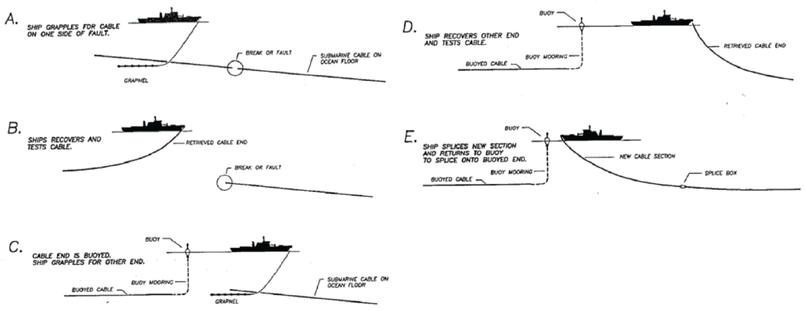

```{r setup, include=FALSE}
# set working directory
if (basename(getwd()) == 'nrel-cables') setwd('docs')

# load packages and variables
source('./packages_vars.R')

#opts_chunk$set(warning=F, message=F)
opts_chunk$set(warning=F, message=F, eval=T, cache=T) # DEBUG
fig_type = 'png' # 'png','pdf','html'
fig_dpi = 300
redo = F

if (interactive() || "rmarkdown.pandoc.to" %in% names(opts_knit$get()) && opts_knit$get("rmarkdown.pandoc.to") == 'html'){
  out_html = T
  #opts_chunk$set(echo=T)
  opts_chunk$set(echo=F)
} else {
  out_html = F
  opts_chunk$set(echo=F)
}

fmt_tbl = function(csv, params, energy_hdr, caption){

  # csv = wave_depth_cbls_csv; params = plot_energy_params$wave; energy_hdr = 'Wave Energy (kW/m)'; caption = 'Table 5: Area overlap with cables for wave energy (kW/m) by territory.'
  
  d = get_tbl_energy_cbls(csv, params)
  
  hdr = htmltools::withTags(table(
    class = 'display',
    thead(
      tr(
        th(rowspan=2, 'Territory'),
        th(rowspan=2, HTML(energy_hdr)),
        th(rowspan=2, HTML('<i>Area (km<sup>2</sup>)</i>')),
        th(colspan=2, 'Overlap with Cable Separation'),
      tr(
        th(HTML('Min. - Max. km<sup>2</sup> (Min. - <i>Max. %</i>)')))))))

  d %>%
    mutate(
      territory  = ifelse(duplicated(territory), '', territory),
      o_2z_km2 = comma(round(cable2_km2)),
      o_3z_km2 = comma(round(cable3_km2)),
      o_2z_pct = sprintf('%0.1f', cable2_pct*100),
      o_3z_pct = sprintf('%0.1f', cable3_pct*100),
      overlap = sprintf(
        # get sprintf for padding with spaces
        sprintf(
          '%%%ds - %%%ds (%%%ds - %%%ds%%%%)',
          max(nchar(o_2z_km2)),
          max(nchar(o_3z_km2)),
          max(nchar(o_2z_pct)),
          max(nchar(o_3z_pct))),
        o_2z_km2, 
        o_3z_km2,
        o_2z_pct, 
        o_3z_pct),
      overlap     = str_replace_all(overlap, ' ', '&nbsp;'),
      overlap_svg = sprintf(
        '<svg xmlns="http://www.w3.org/2000/svg" version="1.1" width="100%%" height="16" preserveAspectRatio="xMaxYMin meet">
<g>
  <rect width="%0.1f%%" height="16" fill="Pink"></rect>
  <text text-anchor="end" x="100%%" y="14" font-family="Courier New" font-size="14px" color="black">%s</text>
</g>
</svg>', cable3_pct*100, overlap),
area_svg = sprintf(
  '<svg xmlns="http://www.w3.org/2000/svg" version="1.1" width="100%%" height="14px" preserveAspectRatio="xMaxYMin meet">
<g>
  <rect width="%0.1f%%" height="14" fill="DarkGray"></rect>
  <text text-anchor="end" x="100%%" y="11" font-family="Courier New" font-size="14px" color="black">%s</text>
</g>
</svg>', area_km2 / max(area_km2) * 100, comma(round(area_km2)))) %>% # ,
    select(territory, energy, area_svg, overlap_svg) %>%
    datatable(
      escape = F,
      rownames=F,
      container=hdr,
      caption=caption,    
      options = list(
        dom='t',
        pageLength = nrow(d), 
        ordering=F,
        autoWidth = TRUE,
        columnDefs = list(
          list(width = '80px', targets = c(2)),
          list(width = '240px', targets = c(3)),
          list(className='dt-right', targets=1:3))))
}

get_tbl_energy_cbls = function(csv, params){
  
  #csv    = wave_depth_cbls_csv
  #params = plot_energy_params$wave
  
  d = read_csv(csv) %>% .$territory %>% # TODO: caption on Atlantic Islands dropping
    filter(
      !is.na(territory),
      territory != 'ALL',
      depth_factor %in% params$depth_ranges,
      energy_factor != params$energy_labels[1]) %>%
    # summarize across depths
    group_by(territory, energy_factor) %>%
    summarize(
      area_km2 = sum(area_km2),
      cable2_km2 = sum(cable2_km2),
      cable3_km2 = sum(cable3_km2)) %>% 
    mutate(
      cable2_pct = cable2_km2 / area_km2,
      cable3_pct = cable3_km2 / area_km2,
      energy     = factor(energy_factor, params$energy_labels, ordered=T),
      pct_lbl    = sprintf('%0.1f - %0.1f%%', cable2_pct*100, cable3_pct*100)) %>%
    ungroup() %>%
    arrange(territory, energy) %>%
    select(territory, energy, area_km2, cable2_km2, cable3_km2, cable2_pct, cable3_pct, pct_lbl)
  
  
  
  d
}

plot_cbls = function(
  csv           = tide_depth_cbls_csv,
  params        = plot_energy_params$tidal,
  legend_position      = c(1,1),
  legend_justification = c(1,1)){ 

  # csv    = wave_depth_cbls_csv
  # params = plot_energy_params$wave
  # legend_position      = c(1,0.3)
  # legend_justification = c(1,1)
  
  d = get_tbl_energy_cbls(csv, params)

  d_lbl = d %>%
    mutate(
      type = NA)
  
  d_p = d %>%
    mutate(
      min_2d = cable2_km2,
      rec_3d = cable3_km2 - cable2_km2,
      rem    = area_km2 - cable3_km2) %>%
    select(
      territory, energy, min_2d, rec_3d, rem) %>%
    gather(type, km2, -energy, -territory) %>%
    mutate(
      type = factor(
        type,
        names(cable_ord),
        cable_ord, ordered=T)) %>%
    arrange(territory, energy, type)
  
  p = ggplot(
      data=d_p,
      aes(x = energy, y = km2/1000, fill=type)) +
    geom_col() +
    geom_text(
      data=d_lbl,
      aes(x = energy, y = area_km2/1000, label=pct_lbl), vjust=-0.5, size=2.5) +
    labs(
      x = parse(text=params$xlab), 
      y = expression(paste('Area (1,000 ', km^2,')')), fill='Overlap') +
    theme(
      legend.justification = legend_justification, 
      legend.position      = legend_position,
      axis.text.x = element_text(angle = 45, hjust = 1)) + 
    expand_limits(y = expand_range(c(0, max(d$area_km2/1000)), mul=0.1)[2]) + 
    facet_wrap(~territory) 
  print(p)
}

fig_exists = function(fig){ 
  fig_ext = sprintf('%s.%s', fig, fig_type)
  file.exists(fig_ext)}

map_cable = function(
  ter,
  fig,
  redo){
  # ter = 'Hawaii'; fig = sprintf('figs/mapCable_%s', str_replace_all(ter,' ','-')); energy_sf = wind_sf; legend_title = sprintf('Submarine cables within %s EEZ.', ter); redo = T
  
  fig_ext = sprintf('%s.%s', fig, fig_type)
  if (!file.exists(fig_ext) | redo){
    
    eez = usa_eez %>%
      filter(territory==ter)
    cables = lns_d1x %>%
      filter(territory==ter)
    cables2 = dx2 %>%
      filter(territory==ter)
    cables3 = dx3 %>%
      filter(territory==ter)
    
    bb = st_bbox(eez)
    bb_ply = st_sf(
      tibble(
        territory = ter,
        geom = st_sfc(st_polygon(list(rbind(
          c(bb['xmin'], bb['ymin']),
          c(bb['xmax'], bb['ymin']),
          c(bb['xmax'], bb['ymax']),
          c(bb['xmin'], bb['ymax']),
          c(bb['xmin'], bb['ymin'])))), crs = 4326)))
    earth = land %>%
      filter(
        st_intersects(land, bb_ply, sparse=F)[,1]) # plot(earth)

    p = ggplot(data=eez) +
      geom_sf(data=earth, fill='gray40', size=0.2, color=NA) +
      geom_sf(data=eez, fill=NA, color='gray40') +
      geom_sf(data=cables3, fill='red', color=NA, alpha=0.15) +
      geom_sf(data=cables2, fill='red', color=NA, alpha=0.15) +
      geom_sf(data=cables, color='red', size=0.1, alpha=0.9) +
      coord_sf(
        xlim=bb[c('xmin','xmax')], 
        ylim=bb[c('ymin','ymax')])
      
    if (fig_type=='pdf'){
      pdf(fig_ext, width=6.5, height=5)
    }  else {
      png(fig_ext, res=fig_dpi, width=6.5, height=5, units='in')
    }
    print(p)
    dev.off()
  }
  #system(sprintf('open %s', fig))
  #knitr::include_graphics(fig, dpi=fig_dpi)
}

map_energy_sf = function(
  energy_sf,
  ter,
  legend_title){
  # ter = 'Hawaii'; energy_sf = wind_sf; legend_title = 'Wind<br>power (m/s)'; redo = T
  # ter =   'West'; energy_sf = wave_sf; legend_title = 'Wave\nenergy\n(kW/m)'; redo = T
  
  d = energy_sf %>% 
    filter(territory==ter)
  cables = lns_d1x %>%
    filter(territory==ter)
  cables2 = cbls2 %>%
    filter(territory==ter)
  cables3 = cbls3  %>%
    filter(territory==ter)

  bb = st_bbox(d)

  pal_energy = colorFactor('BuGn',      d$energy)
  pal_depth  = colorFactor('OrRd', cables3$depth, reverse=T)
  
  m = leaflet(d, 
              options=c(leafletOptions(), attributionControl=F, zoomControl=F)) %>% 
    addProviderTiles('Stamen.TonerLite', group = 'B&W') %>%
    #addProviderTiles('Esri.OceanBasemap', group = 'Ocean') %>%
      #, options = c(providerTileOptions(), list(attribution=''))) %>% # 
    addPolygons(
      group=legend_title,
      #fillColor = ~pal_energy(energy), fillOpacity = 0.5, color=NA) %>% 
      fillColor = ~pal_energy(energy), fillOpacity = 0.5, stroke=F) %>% 
    addPolygons(
      data = cables2, group='Min. Cable (2x)',
      #fillColor=~pal_depth(depth), fillOpacity = 0.3, color=NA) %>%
      fillColor=~pal_depth(depth), fillOpacity = 0.3, stroke=F) %>%
    addPolygons(
      data = cables3, group='Rec. Cable (3x)',
      #fillColor=~pal_depth(depth), fillOpacity = 0.3, color=NA) %>%      
      fillColor=~pal_depth(depth), fillOpacity = 0.3, stroke=F) %>%      
    addPolylines(
      data = cables, group='Cables',
      color='black', opacity = 0.5, weight=0.4) %>% #,
    fitBounds(bb[['xmin']],bb[['ymin']],bb[['xmax']],bb[['ymax']]) %>%
    addLegend(
      position='bottomright', 
      pal=pal_energy, values=~energy, title=legend_title) %>%
    addLegend(
      position='bottomright', 
      pal=pal_depth, values=cables3$depth, title='Cable<br>depth (m)') %>%
    # addLayersControl(
    #   baseGroups = c('Ocean','B&W'),
    #   overlayGroups = c(legend_title, 'Min. Cable (2x)', 'Rec. Cable (3x)', 'Cables'),
    #   options = layersControlOptions(collapsed=T)) %>%
    addScaleBar('bottomleft')
  
  ## save html to png
  # saveWidget(m, "test.html", selfcontained = FALSE)
  # webshot("test.html", file = "test.png", cliprect = "viewport", delay=1)
  # system('open test.png')
  
  m
}

map_tide = function(
  ter,
  legend_title='Tidal<br>power (W/m<sup>2</sup>)'){
  # ter = 'Puerto Rico'; legend_title = 'Tidal<br>power (W/m<sup>2</sup>)'
  # ter = 'Alaska'; legend_title = 'Tidal\npower\n(W/m2)'
  
  ter_str = str_replace_all(ter, ' ', '-')
  tif = sprintf('../data/tide_ter-%s.tif', ter_str)
  r = raster(tif) # plot(r)
  
  # aggregate and adjust to [-180,180] from [0,360] for leaflet to show
  r_a = aggregate(r, fact=8, fun=max) %>%
    shift(-360) %>%
    cut(breaks = tide_breaks, include.lowest=T) # plot(r_a)
  bb = bbox(r_a)
  
  # project to leaflet's mercator using nearest neighbor for factor color palette
  r_m = projectRaster(r_a, projectExtent(r_a, crs = CRS(leaflet:::epsg3857)), method='ngb')
  
  # use cables reprojected to [-180,180]
  cables = cbls_180 %>%
    filter(territory==ter)
  cables2 = cbls2_180 %>%
    filter(territory==ter)
  cables3 = cbls3_180 %>%
    filter(territory==ter)

  n_lbl = length(tide_labels)
  pal_energy = colorFactor(
    palette = 'BuGn', na.color="#00000000",
    domain  = 1:n_lbl)
  pal_depth  = colorFactor('OrRd', cables3$depth, reverse=T)

  m = leaflet(
    options=c(leafletOptions(), attributionControl=F, zoomControl=F)) %>% 
    addProviderTiles('Stamen.TonerLite', group = 'B&W') %>%
    #addProviderTiles('Esri.OceanBasemap', group = 'Ocean') %>%
    addRasterImage(
      r_m, project=F, group=legend_title,
      colors=pal_energy, opacity=0.7) %>%
    addPolygons(
      data = cables3, group='Min. Cable (2x)',
      fillColor=~pal_depth(depth), fillOpacity = 0.3, stroke=F) %>%
    addPolygons(
      data = cables2, group='Rec. Cable (3x)',
      fillColor=~pal_depth(depth), fillOpacity = 0.3, stroke=F) %>%      
    addPolylines(
      data = cables, group='Cables',
      color='black', opacity = 0.5, weight=0.4) %>%
    fitBounds(bb[1,'min'],bb[2,'min'],bb[1,'max'],bb[2,'max']) %>%
    addLegend(
      position = 'bottomright', 
      colors   = pal_energy(1:n_lbl), 
      labels   = tide_labels,
      title=legend_title) %>%
    addLegend(
      position='bottomright', 
      pal=pal_depth, values=cables3$depth, title='Cable<br>depth (m)') %>%
    # addLayersControl(
    #   baseGroups = c('Ocean','B&W'),
    #   overlayGroups = c(legend_title, 'Min. Cable (2x)', 'Rec. Cable (3x)', 'Cables'),
    #   options = layersControlOptions(collapsed=T)) %>%
    addScaleBar('bottomleft')
   m
}

# calculate length of cables / comment to speed up
# lns_km = read_sf(lns_geo) %>%
#   mutate(
#     length = st_length(geometry)) %>%
#   summarize(length_km = sum(length)/1000) %>% 
#   .$length_km %>% as.numeric()
# 
# lns_d1x_km = lns_d1x %>%
#   mutate(
#     length = st_length(geometry)) %>%
#   summarize(length_km = sum(length)/1000) %>% 
#   .$length_km %>% as.numeric()
lns_km = 230834.9
lns_d1x_km = 97321.2

# revert to old red-green-blue default color, not new viridis
#   per https://github.com/tidyverse/ggplot2/blob/00ecd3670ef0f1c195bf4c6b5ada3b1895712f1c/NEWS.md#ggplot2-2219000
scale_fill_ordinal = scale_fill_hue

#usa2    = wrld2 %>% filter(ID=='USA')
wrld2   = st_as_sf(map('world2', plot=F, fill=T))
usa_eez = read_sf(usa_rgn_geo)
land    = read_sf(land_usaeez_geo)
lns_d1x = read_sf(lns_d1x_rgn_geo)
dx2     = read_sf(dx2_depth_geo)
dx3     = read_sf(dx3_depth_geo)
usa_dx = read_csv(usa_dx_csv)

cbls2 = dx2 %>%
  filter(
    depth_factor != depth_labels[1]) %>%
  mutate(
    depth = factor(
      x      = depth_factor,
      levels = depth_labels[-1],
      labels = depth_labels[-1],
      ordered = T))
cbls3 = dx3  %>%
  filter(
    depth_factor != depth_labels[1]) %>%
  mutate(
    depth = factor(
      x      = depth_factor,
      levels = depth_labels[-1],
      labels = depth_labels[-1],
      ordered = T))

# set to [-180,180] from [0,360] for tide raster leaflet -- hacked at:
#  [sf::st_transform not honoring +lon_wrap](https://github.com/edzer/sfr/issues/280)
cbls_180 = lns_d1x %>%
    mutate(geometry = (geometry + c(360,90)) %% c(-360) - c(0,-360+90)) %>% 
    st_set_crs(crs_gcs)
cbls2_180 = cbls2 %>%
    mutate(geometry = (geometry + c(360,90)) %% c(-360) - c(0,-360+90)) %>% 
    st_set_crs(crs_gcs)
cbls3_180 = cbls3  %>%
    mutate(geometry = (geometry + c(360,90)) %% c(-360) - c(0,-360+90)) %>% 
    st_set_crs(crs_gcs)
```

# Background

The submarine cable industry handles 95% of inter-continental internet, data and voice traffic [@communicationssecurityreliabilityandinteroperabilitycounciliv_protection_2014], and is thus vital to the US and global economy. Repair and maintenance of cables traditionally involves grappling the cable and floating it to the surface, so allowance for drift of the repairing vessel and laying down of the additional splice of cable is depedent on bottom depth (Figure \@ref(fig:figSubmarineCableRepair)).

```{r figSubmarineCableRepair, fig.cap='Ship operations for submarine cable repair. The ship runs a grapnel along the seafloor to catch the cable before the break, recovers and buoys one end of the cable, grapples and recovers the other, and splices a new section of repaired cable before laying it back onto the seafloor. Source: Tyco Electronics Subsea Communications, LLC', echo=F}

```


```{r tbl01Territories}
caption = HTML('Table 1: Territories having submarine cables within the United States exclusive economic zone (EEZ) of 200 nm. Territory area (km<sup>2</sup>) and length of submarine cables (km) are reported with horizontal indicator bars proportional to values in rest of column (with italics headers). Remaining columns indicate whether energy resources (tidal, wave or wind) are characterized for the territory. The Pacific Island territories (Guam, Johnston Atoll, N. Mariana Islands, Palmyra Atoll, Wake Island) have submarine cables but no energy resource characterization, whereas the Atlantic Island territories (Puerto Rico, US Virgin Islands) have tidal and wind.')

# territories with energy
ter_energy = map2(
  c(tide_depth_cbls_csv, wave_depth_cbls_csv, wind_depth_cbls_csv), 
  c('tide','wave','wind'),
  ~ read_csv(.x) %>% mutate(form = .y)) %>%
  bind_rows() %>%
  group_by(territory, form) %>%
  summarize(
    has_form = T) %>%
  filter(territory != 'ALL') %>%
  spread(form, has_form)
write_csv(ter_energy, '../data/energy_territories.csv')

# territory cable lengths
ter_cables = read_sf(lns_d1x_rgn_geo) %>%
  mutate(
    length=st_length(geometry)) %>%
  st_set_geometry(NULL) %>%
  group_by(territory) %>%
  summarize(
    length=sum(length, na.rm=T))

# territory areas
ter_area = usa_eez %>%
  select(territory, area_km2) %>% 
  st_set_geometry(NULL)

# territory combined: area, cable, energy checks
d_ter = ter_area %>%
  left_join(
    ter_cables, by='territory') %>%
  left_join(
    ter_energy, by='territory') %>%
  mutate(
    territory1 = territory,
    territory = ifelse(
      territory1 %in% ter_pac_islands, 
      'Pacific Islands',
      ifelse(
        territory1 %in% ter_atl_islands, 
        'Atlantic Islands',
        territory1))) %>%
  group_by(territory) %>%
  summarize(
   #territory1 = paste(territory1, collapse=', '),
   area_km2   = sum(area_km2),
   length_km  = sum(as.numeric(length)) / 1000,
   tide = sum(tide, na.rm=F),
   wave = sum(wave, na.rm=F),
   wind = sum(wind, na.rm=F)) %>%
  mutate(
    tide = ifelse(!is.na(tide), '✓', ''),
    wave = ifelse(!is.na(wave), '✓', ''),
    wind = ifelse(!is.na(wind), '✓', ''))

d_ter = d_ter %>%
  bind_rows(
    # ALL summary
    d_ter %>%
      summarize(
        territory = 'ALL',
        area_km2  = sum(area_km2),
        length_km = sum(length_km),
        tide = '✓',
        wave = '✓',
        wind = '✓'))

hdr = htmltools::withTags(table(
  class = 'display',
  thead(
    tr(
      th('Territory'),
      th(HTML('<i>Territory (km<sup>2</sup>)</i>')),
      th(HTML('<i>Cable (km)</i>')),
      th('Tidal'),
      th('Wave'),
      th('Wind')))))

d_ter %>%
  mutate(
  area_svg = sprintf(
'<svg xmlns="http://www.w3.org/2000/svg" version="1.1" width="100%%" height="14px" preserveAspectRatio="xMaxYMin meet">
<g>
  <rect width="%0.1f%%" height="14" fill="DarkGray"></rect>
  <text text-anchor="end" x="100%%" y="11" font-family="Courier New" font-size="14px" color="black">%s</text>
</g>
</svg>', area_km2 / max(area_km2) * 100, comma(round(area_km2))),
  length_svg = sprintf(
'<svg xmlns="http://www.w3.org/2000/svg" version="1.1" width="100%%" height="14px" preserveAspectRatio="xMaxYMin meet">
<g>
  <rect width="%0.1f%%" height="14" fill="LightPink"></rect>
  <text text-anchor="end" x="100%%" y="11" font-family="Courier New" font-size="14px" color="black">%s</text>
</g>
</svg>', length_km / max(length_km) * 100, comma(round(length_km)))) %>% # ,
  select(territory, area_svg, length_svg, tide, wave, wind) %>%
  datatable(
    escape = F,
    rownames=F,
    container=hdr,
    caption=caption,    
    options = list(
      dom='t',
      pageLength = nrow(d_ter), 
      ordering=F,
      autoWidth = TRUE,
      columnDefs = list(
        list(width = '130px', targets = c(1)),
        list(width = '130px', targets = c(2)),
        list(className='dt-right', targets=1:2),
        list(className='dt-center', targets=3:5))))
```


